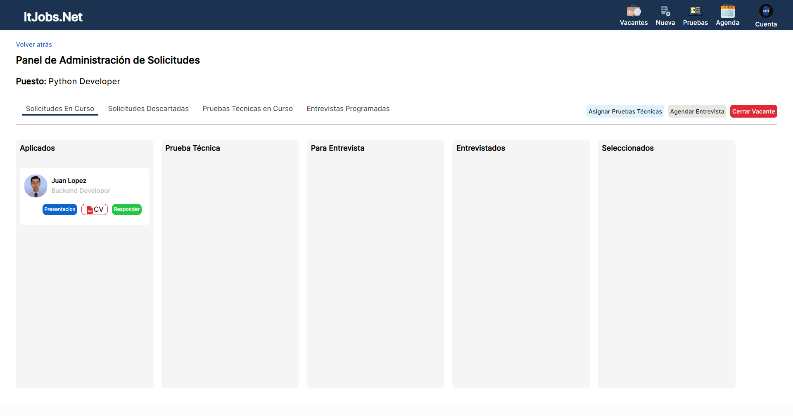
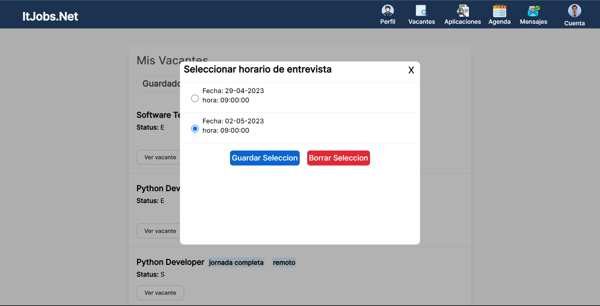

# Vacancy web application

The project idea is to create a platform for recruitment processes employment in the software development area. There will be recruiters, who must publish job offers following a defined structure and candidates who will be looking for a job.

## BackEnd:

- Python
- Django
- Django Rest Framework

## FrontEnd:

- HTML 5
- Tailwind CSS
- JavaScript
- React

## Database

- PosgreSQL

## Third Party App:

- Agora

## Company role

### 1. Company Sign-up 

Registration process for a company, the company has to show certain information and upload the photo of it's perfil.

### 2. Login

This is the page where a user can login into the application.

### 3. Vacancy list

When a company enter into the application can see the list of vacancies, in this case they have not created any vacancy. 

### 4. Create Vacancy

When you press the new vacancy button, can create a vacancy for your company where you have to specific some mandatory and optional information. 

### 5. Vacancy panel

When the company have created a vacancy can see a panel with the candidates that have applied to that job. In this panel they can answer an application and continue to the next section if the candidate meets the needs of the company.

### 6. Technical test

A company can create a technical test for a specific vacancy, after that they can assign it to a candidate with a limit date to send the solution.

### 7. Interview

A company can make interview schedules where they can talk in a video call with a candidate, after that a candidate can select the best hour for it. 

### 8. Close vacancy

When the company has found the ideal candidate can close a vacancy so that it is not possible to receive more applications. After do that the vacancy appears in the closing section of vacancies. 

## Candidate role

### 1. Candidate Sign-up

Registration process for a candidate, the candidate has to show personal information and upload the photo of it's perfil.

### 2. Developer profile

When a candidate enter into the application can modify the profile where can add a CV, experience, projects, etc.

### 3. Job list

In the vacancies page a candidate can see all the open positions in the site and can filter by experience, category, country, etc.

### 4. Job application

When a candidate applied for a job have to send a cover letter and the CV. After applied can see a list of all vacancies have applied for.

### 5. Messages

A candidate can see the messages of their applications when a company decide to continue the process or not.

### 6. Test

When a company send a test, a candidate can see it in their technical test section.

### 7. Interview selection

When a candidate is in the interview phase can select one of the schedules offered by the company.

### 8. Video call module

When the candidate select the schedule, both can see the video call link in the calendar. If press the video call button can access to the module in the application.

### 9. Job

If the candidate is selected for the position will receive a congratulatory message.

